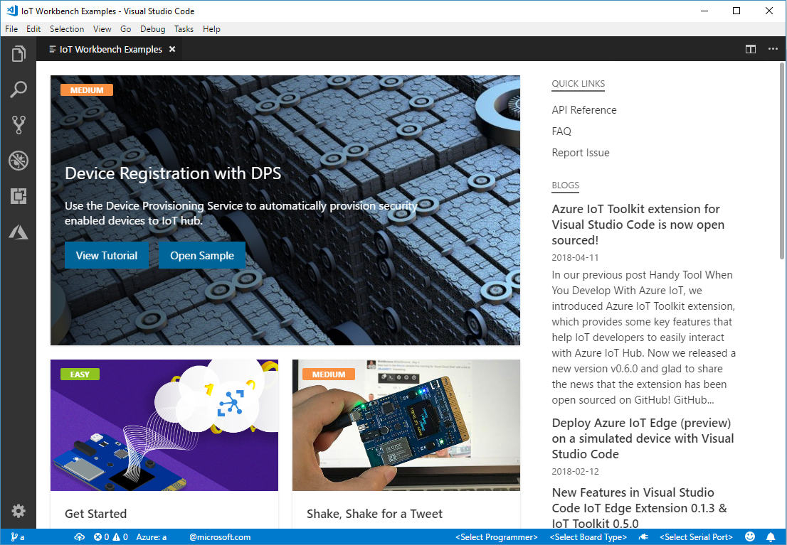
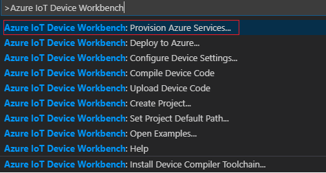
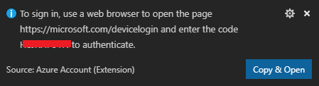
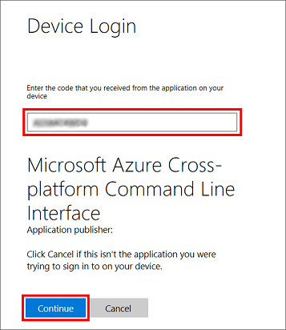
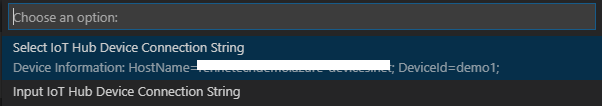
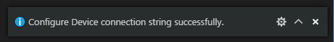

# Connecting an IoT Device to Azure #

---

## Overview ##

Welcome to Cloud City! In this hands-on lab and the ones that follow, you will build a comprehensive IoT solution that demonstrates some of the very best features Microsoft Azure has to offer, including [IoT Hubs](https://azure.microsoft.com/services/iot-hub/), [Event Hubs](https://azure.microsoft.com/services/event-hubs/), [Azure Functions](https://azure.microsoft.com/services/functions/), [Stream Analytics](https://azure.microsoft.com/services/stream-analytics/), and [Cognitive Services](https://azure.microsoft.com/services/cognitive-services/). The solution you build today will culminate into an Air-Traffic Control (ATC) app that shows simulated aircraft flying through an ATC sector and warns users when aircraft get too close to each other. While these labs are best to do with several peers, there is an application in the lab assets which can inject simulated drones into the workstream.

_The Air-Traffic Control application_

You will be the pilot of one of these aircraft. And to do the flying, you will use hardware provided to you for this event. The [MXChip](https://microsoft.github.io/azure-iot-developer-kit/) is an Arduino-based device that is ideal for prototyping IoT solutions. It features an array of sensors, including an accelerometer, a gyrometer, and temperature and humidity sensors, and it includes built-in WiFi so it can transmit data to Azure IoT Hubs wirelessly. It also features a micro-USB port by which you can connect it to your laptop, upload software, and power the hardware. You will control your aircraft by tilting the MXChip backward and forward to go up and down, and rotating it left and right to turn.

_IoT development board_

Here is how the solution is architected, with elements that you will build or deploy highlighted in light blue:

![A data flow diagram showing IoT information originating from an Azure MXChip flowing through IoT Hub and onto an Azure Function.  From the Azure Function, data is bifercated to flow through a client application, as well as to an Event Hub shared by all workshop participants.  The shared Event Hub forwads data to Azure Stream Analytics, where it is forwarded onto another event hub for distribution to the client application.  Additionally, there are data flows from the client application to Cognitive Services and from Stream Analytics to Cosmos DB](Images/architecture.png)

_Solution architecture_

Accelerometer data from the device is transmitted to an Azure IoT Hub. An Azure Function transforms the raw accelerometer data into *flight data* denoting airspeed, heading, altitude, latitude, longitude, pitch, and roll. The destination for that data is a pair of Event Hubs — one that you set up, and one that is shared by every pilot in the room. Events from the "private" Event Hub are consumed by a client app running on your laptop that shows the position and altitude of your aircraft. The events sent to the shared Event Hub go to a Stream Analytics job that analyzes fast-moving data for aircraft that are in danger of colliding and provides that data to the client app and the ATC app. When your aircraft comes too close to another, it turns red on the screen, and a warning appears on the screen of your MXChip. To top it off, Microsoft Cognitive Services translates the warning into the language of your choice.

The goal of this lab is to get the device up and running and sending events to an Azure IoT Hub. Let's get started!

## Labs ##

- [HOL 1](HOL%201/HOL%201%20-%20MXChip.md) - Attendees create an Azure IoT Hub and program an [MXCHIP]([MXChip](https://microsoft.github.io/azure-iot-developer-kit/)) to send accelerometer data to it.
- [HOL 2](HOL%202/HOL%202%20-%20Functions%20and%20Event%20Hubs.md) - Attendees create an Azure Event Hub and deploy an Azure Function that transforms accelerometer data input to the IoT Hub into "flight data" denoting the disposition on an airplane and transmits it to the Event Hub. Then they connect a UWP client app to the Event Hub and use their MXChip to fly a simulated airplane.
- [HOL 3](HOL%203/HOL%203%20-%20Stream%20Analytics.md) - The instructor creates a pair of Event Hubs and deploys a Stream Analytics job that analyzes all the air traffic in the room for aircraft that are within two miles of each another. He or she also deploys a UWP app that shows all the air traffic. **THIS HOL IS INSTRUCTOR-LED**.
- [HOL 4](HOL%204/HOL%204%20-%20Putting%20It%20All%20Together.md) - Attendees modify the Azure Function they deployed in HOL 2 to transmit flight data to the input hub used by Stream Analytics. They also connect the client app to the Stream Analytics output and modify the app to transmit warning messages back to the MXChip when their aircraft are within two miles of another.

## Prerequisites ##

The following are required to complete this lab:

- An [MXChip IoT DevKit](https://microsoft.github.io/azure-iot-developer-kit/)
- A computer running [Windows 10 Anniversary Edition](https://www.microsoft.com/en-us/software-download/windows10) or higher.
- An active Microsoft Azure subscription. If you don't have one, [sign up for a free trial](http://aka.ms/WATK-FreeTrial)
- An available WiFi connection or mobile hotspot. Note that the WiFi connection can (and should) be secure, but it must be ungated (i.e. no intermediate login page is required. Gated WiFi is common in public venues and hotels).

Note: For developers work on a Mac, please see [this article](https://docs.microsoft.com/en-us/windows/uwp/porting/setting-up-your-mac-with-windows-10) for installing Windows 10 to enable building and running the UWP portion of this lab.

## Exercises ##

This lab includes the following exercises:

- [Exercise 1: Prepare development environment](#Exercise1)
- [Exercise 2: Provision Azure Services](#Exercise2)
- [Exercise 3: Deploy an app to the device](#Exercise3)
- [Exercise 4: Check IoT Hub activity](#Exercise4)
 
Estimated time to complete this lab: **60** minutes.

## Exercise 1: Prepare development environment ##
Finish the [Getting Started Guide](https://github.com/Microsoft/vscode-iot-workbench/blob/master/docs/iot-devkit/devkit-get-started.md) to:

* Have your DevKit connected to Wi-Fi.
* Prepare the development environment.

In [Exercise 2](#Exercise2), you will use the development environment you just set up to upload code to the MXChip that transmits data to an Azure IoT Hub. Your next task, however, is to provision Azure services.

## Exercise 2: Provision Azure Services ##

[Azure IoT Hubs](https://docs.microsoft.com/azure/iot-hub/iot-hub-what-is-iot-hub) enable IoT devices to connect securely to the cloud and transmit messages (events) that can be ingested by apps and other Azure services. They support bidirectional communication, and they are built to be massively scalable. A single IoT Hub can handle millions of events per second. Messages can be sent over HTTP, or using the [Advanced Message Queuing Protocol](https://docs.microsoft.com/en-us/azure/iot-hub/iot-hub-what-is-iot-hub) (AMQP) or [Message Queueing Telemetry Transport](https://docs.microsoft.com/en-us/azure/iot-hub/iot-hub-what-is-iot-hub) (MQTT) protocol. Devices can be authenticated using per-device security keys or X.509 certificates.

In this exercise, you will open an project of **Air Traffic Simulator** in Visual Studio Code and provision an Azure IoT Hub for your MXChip to transmit events to and create a Azure Functions application.

1. Start VS Code first, and then connect the IoT DevKit to your computer.

1. Use `F1` or`Ctrl+Shift+P` (macOS: `Cmd+Shift+P`) to open the command palette, type **Azure IoT Device Workbench**, and then select **Open Examples...**.

	

	Select **IoT DevKit**.
		
	

	Then the **IoT Device Workbench Example** window is shown up.

	

1. Find **Air Traffic Simulator** and click **Open Sample** button. A new VS Code window with a project folder in it opens.
 
1. In the solution window, open the command palette and select **Azure IoT Device Workbench: Provision Azure Services...**.

	

1. If you haven't login to Azure in Visual Studio Code before, the following will be pop-up to guide you for Azure sign-in. 
	

1. Click **Copy & Open** and go to the "Device Login" screen in the browser, paste the login code into the input field, and click **Continue**.

	

	After sign-in successfully, open the command palette, type **Azure: Select Subscription** to select the subscription you want to use and then re-run **Azure IoT Device Workbench: Provision Azure Services...**

1. In the dropdown list of **Select Resource Group**, click **Create Resource Group** and then provide the following information:

	| Name | Value |
	| --- | --- |
	| Resource Group Name  | flysimresources |
	| Resource Group Location | East US |

1. In the dropdown list of **Provision IoT Hub**, click **Create a new IoT Hub**, first select the location of **East US**.
	> You selected East US as the location because in Lab 3, the instructor will create Azure resources in that same region for the IoT Hub to connect to. Azure resources can be connected across regions, but keeping everything within the same data center reduces cost and minimizes latency.

	Make sure **S1 - Standard tier** is selected as the pricing tier. Enter a unique name for IoT Hub name. IoT Hub names must be unique across Azure. 

1. Wait until the IoT Hub has been provisioned. In the dropdown list of **Provision IoTHub Device**, select **Create a new IoT Hub device**. Provide a device name and press 'Enter'.

	Because you selected **S1 - Standard** as the pricing tier in Step 3, you can transmit up to 400,000 messages a day to the IoT Hub for $50 per month. A **Free** tier that accepts up to 8,000 messages per day is also available, but that tier might be too limiting for today's exercise. For more information on the various pricing tiers that are available, see [IoT Hub pricing](https://azure.microsoft.com/pricing/details/iot-hub/).

1. The last item to provision is the 'Azure Functions', in this exercise, let's first create the a new Function App and we will deploy the code to the Function App in next Lab.

	First, provide a globally unique name for the new Function App. Then, in the dropdown list of **Select a storage account**, click **Create new storage account**. Enter the name of the new storage account and make sure to choose **East US** as the location for the new resources. Wait until the Function App has been provisioned.

## Exercise 3: Deploy an app to the device ##

In this exercise, you will compile an embedded C++ app that transmits events to your Azure IoT Hub and use Visual Studio Code to upload it to the MXChip. Once the app is uploaded, it will begin executing on the device, and it will send a JSON payload containing three accelerometer values (X, Y, and Z) as well as temperature and humidity readings approximately every two seconds. The app is persisted in the firmware and automatically resumes execution if the device is powered off and back on.

1. In Visual Studio Code, browse to the "FlySimEmbedded" folder included in the "FlySim" workspace. 

1. Open **config.h** and replace YOUR_DISPLAY_NAME with a friendly display name. Then save the file. **This name will be seen by everyone when the ATC app is run in Lab 4**, so please choose a name that's appropriate. Also make it as **unique as possible** by including birth dates (for example, "Amelia Earhart 093059") or other values that are unlikely to be duplicated.

	

    _Entering a display name_
 
1. Open the command palette and select **Azure IoT Device Workbench: Configure Device Settings...**.

	

1. Select **Config Device Connection string**.

1. Then select **Select IoT Hub Device Connection String**.

	

   This sets the connection string that is retrieved from the `Provision Azure services` step.

1. Wait until you are prompted in the pop-up window with "hold on Button A and then press Button Reset to enter configuration mode." Then do the following:

	- Press and hold the **A button** on the device 
	- With the A button held down, press and release the **Reset button**
	- Release the **A button**

1. The configuration success notification popup bottom right corner once it's done.

     

1. Now it's time to upload code to the device to have it transmit events to the IoT Hub. Open the command palette and select **Azure IoT Device Workbench: Upload Device Code**.

	

1. VS Code then starts verifying and uploading the code to your DevKit.

	After a brief pause, the C++ app that reads accelerometer data and transmits it to the IoT Hub will begin uploading to your device. If you are curious to see what the source code looks like, examine the CPP files in the project directory in Visual Studio Code. 

1. After the device restarts, confirm that the message "IN FLIGHT" appears on the screen of the device, followed by X, Y, and Z values that change when you tilt the board in any direction. These are the accelerometer values passed to the IoT Hub. The fact that they appear on the screen confirms that the upload was successful and that the app is running on the device.

	

    _MXChip with your embedded code running on it_

We know that the device is transmitting events. Now let's make sure those events are being received by the IoT Hub.

## Exercise 4: Check IoT Hub activity ##

In this exercise, you will use the Azure portal to confirm that the MXCHip is registered with the IoT Hub you created in [Exercise 3](#Exercise3), and also confirm that the hub is receiving messages from the device.

1.  Return to the Azure portal and to the "FlySimResources" resource group. Then click the IoT Hub that you created in Exercise 3.

	

    _Opening a blade for the IoT Hub_

1. Click **Overview** and look at the count of messages received and the number of devices registered. Confirm that the device count is 1, and that the number of messages received is greater than zero.

	

    _Stats regarding the IoT Hub_

1. Click **Device Explorer** to display a list of all devices that are registered to communicate with this IoT Hub. Confirm that your device ("AZ3166") appears in the list.

	

    _Devices registered with the IoT Hub_

1. Return to Visual Studio Code and click the **Connect** icon in the status bar at lower right.

	

    _Connecting to the device via a COM port_

1. When the icon changes to an 'X', click the Baud rate on the left and select **115200** from the drop-down list to increase the Baud rate. 

	

    _Increasing the Baud rate_

1. Look in Visual Studio Code's Output window and confirm that events are being transmitted. You can also see the JSON format in which they're transmitted. This is the raw data streaming to the IoT Hub. Note that the display name you entered in the previous exercise is transmitted in a field named "deviceId," and that each message includes a timestamp in the "timestamp" field.

	

    _Events transmitted from the device to the IoT Hub_

The MXChip is now running embedded code that sends accelerometer data to the IoT Hub. Consumers of that data can examine the X, Y, and Z values and determine the device's physical orientation in space. This sets the stage for the next lab, in which you will make use of that data.

## Summary ##

In this lab, you created an Azure IoT Hub and configured your MXChip to send data to it.

In Lab 2, you will build the infrastructure necessary to fly a simulated aircraft using the MXChip. That infrastructure will consist of an Azure Function that transforms accelerometer readings passing through the IoT Hub into flight data denoting the position and attitude of an aircraft, as well as an Azure Event Hub that receives data from the Azure Function. Once the Function and Event Hub are in place, you will connect a client app to the Event Hub and practice flying an aircraft by tilting your MXChip backward and forward to go up and down and rotating it right and left to bank and turn. In other words, the fun is just beginning!
