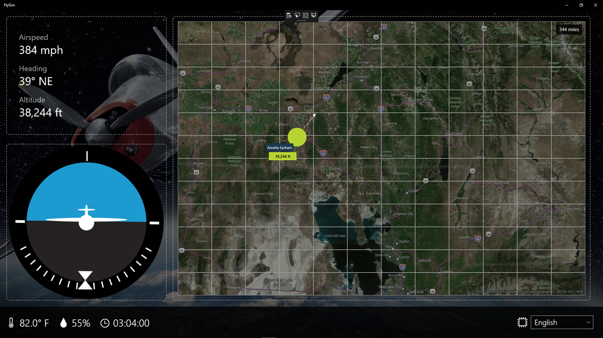
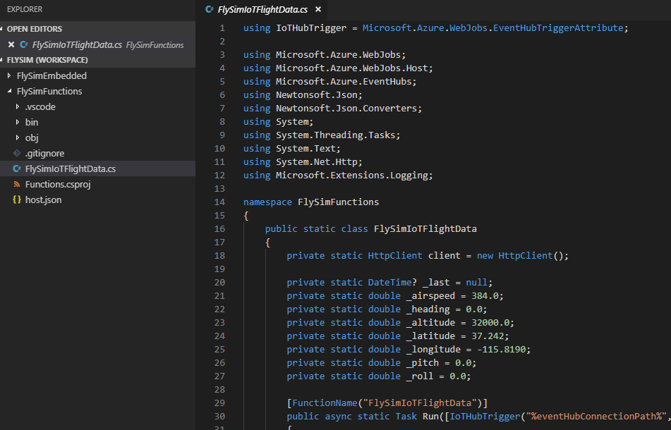
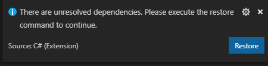
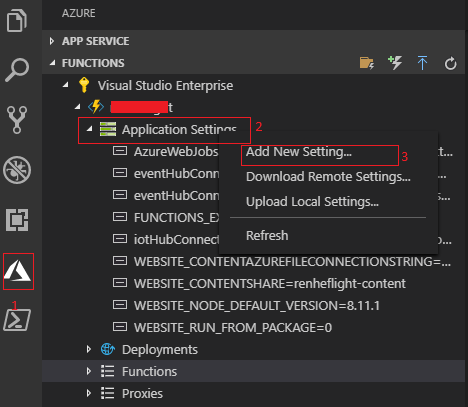
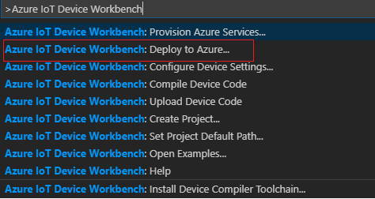
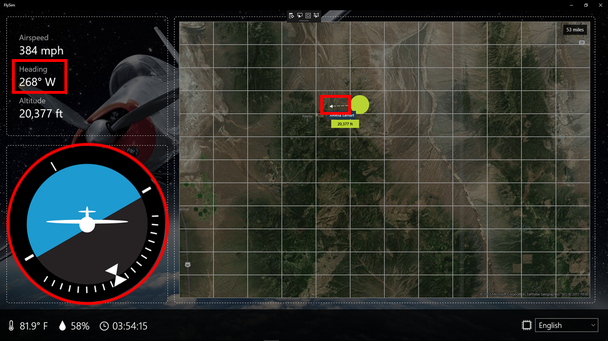
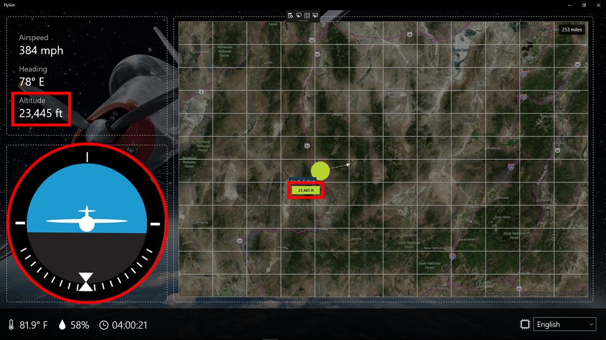

<a name="HOLTitle"></a>
# Using Azure Functions and Azure Event Hubs to Process IoT Data #

---

<a name="Overview"></a>
## Overview ##

In Lab 1, you configured an [MXChip](https://microsoft.github.io/azure-iot-developer-kit/) to transmit accelerometer data to an Azure IoT Hub. That IoT Hub receives a stream of data revealing the device's 3D orientation in space. It knows, for example, whether the device is tilted forward or backward (and by how much), and it knows when the device is rotated left and right. The app that you uploaded to the device transmits an event containing X, Y, and Z accelerometer readings every two seconds.

In Lab 2, you will build the infrastructure necessary to fly a simulated aircraft using your MXChip. That infrastructure will consist of an Azure Function that transforms accelerometer readings passing through the IoT Hub into flight data denoting the position and attitude of an aircraft, as well as an Azure Event Hub that receives data from the Azure Function. Once the Function and Event Hub are in place, you will connect a client app named **FlySim** to the Event Hub and practice flying an aircraft using your MXChip. The client app, pictured below, subscribes to events from the Event Hub and shows the disposition of your aircraft in near real time.



_The FlySim app_

<a name="Prerequisites"></a>
### Prerequisites ###

The following are required to complete this lab:

- An [MXChip IoT DevKit](https://microsoft.github.io/azure-iot-developer-kit/)
- A computer running [Windows 10 Anniversary Edition](https://www.microsoft.com/en-us/software-download/windows10) or higher
- [Visual Studio 2017](https://www.visualstudio.com/downloads/) Community edition version 15.3 or higher with the UWP and Azure workloads installed
- An active Microsoft Azure subscription. If you don't have one, [sign up for a free trial](http://aka.ms/WATK-FreeTrial)
- An available WiFi connection or mobile hotspot
- Finish the [Getting Started Guide](https://github.com/Microsoft/vscode-iot-workbench/blob/master/docs/iot-devkit/devkit-get-started.md) to:

	* Have your DevKit connected to Wi-Fi.
	* Prepare the development environment.

Note: For developers work on a Mac, please see [this article](https://docs.microsoft.com/en-us/windows/uwp/porting/setting-up-your-mac-with-windows-10) for installing Windows 10 to enable building and running the UWP portion of this lab.

---

<a name="Exercises"></a>
## Exercises ##

This lab includes the following exercises:

- [Exercise 1: Provision an Azure Event Hub](#Exercise1) 
- [Exercise 2: Write an Azure Function to transform data](#Exercise2)
- [Exercise 3: Connect the client app to the Event Hub](#Exercise3)
 
Estimated time to complete this lab: **60** minutes.

<a name="Exercise1"></a>
## Exercise 1: Provision an Azure Event Hub ##

Azure IoT Hubs were created to provide secure, bidirectional endpoints for IoT devices to talk to. They are wrappers around [Azure Event Hubs](https://azure.microsoft.com/services/event-hubs/), which support unidirectional communication only but are ideal for aggregating events at scale and disseminating those events to interested clients. "Client" could mean another Azure service such as [Stream Analytics](https://azure.microsoft.com/services/stream-analytics/), or it could be an app you've written that subscribes to events reaching the Event Hub.

In this exercise, you will use the Azure Portal to create an Event Hub that will ultimately receive data from an Azure Function attached to the IoT Hub you created in Lab 1, and that will provide input to the FlySim app. 

1. Open the [Azure Portal](https://portal.azure.com) in your browser. If asked to log in, do so using your Microsoft account.

1. Click **+ New**, followed by **Internet of Things** and **Event Hubs**.

	

    _Adding a new event hub_

1. Type a namespace name into the **Name** box. The name must be unique within Azure, so make sure a green check mark appears next to it. Also make sure **Pricing tier** is set to **Standard**. Select **Use existing** under **Resource group** and select the "FlySimResources" resource group that you created in Lab 1. Choose the **East US** region in the **Location** drop-down, and then click **Create**.

	> It is important to select the East US region to locate the Event Hub in the same region as the IoT Hub you created in Lab 1. This reduces cost and minimizes latency.

    

    _Creating a namespace_

1. Click **Resource groups** in the ribbon on the left side of the portal, and then click **FlySimResources** to open the resource group.

	

    _Opening the resource group_

1. Wait until "Deploying" changes to "Succeeded," indicating that the IoT Hub has been provisioned. (You can click the **Refresh** button at the top of the blade to refresh the deployment status.) Then click the Event Hub that you just created.

	

    _Successful deployment_
 
1. Click **+ Event Hub** at the top of the blade.

	

    _Adding an Event Hub_
 
1. Type "flysim" (without quotation marks) into the **Name** box. Then click the **Create** button.
 
	

    _Creating an Event Hub_

1. Wait a moment for the Event Hub to be created. Then confirm that "flysim" appears in the list of Event Hubs.
 
	

    _The new Event Hub_

How much do Azure Event Hubs cost? The **Standard** pricing tier that you selected in Step 3 incurs a nominal charge per million events received, as well as a flat hourly charge per throughput unit. Currently, an Event Hub with one throughput unit (each throughput unit can handle 1 MB per second of data input and 2 MB per second of data output) that receives one million events per day costs less than a dollar a day. For more information and current pricing, see [Event Hubs pricing](https://azure.microsoft.com/pricing/details/event-hubs/).


<a name="Exercise2"></a>
## Exercise 2: Deploy the Azure Function to transform data ##

[Azure Functions](https://azure.microsoft.com/services/functions/) enable you to deploy code to the cloud and execute it there without separately spinning up virtual machines (VMs) or other infrastructure to host them. They can be written in a number of languages, including C#, F#, JavaScript, Python, Bash, and PowerShell, and they are easily connected to Azure IoT Hubs and Event Hubs.

You can write Azure Functions in the Azure Portal, or you can write them in Visual Studio Code. In this exercise, you will use Visual Studio Code to deploy an existing Azure Function that transforms raw accelerometer data arriving at the IoT Hub you created in Lab 1 into flight data denoting the disposition of an aircraft, and that transmits the transformed data to the Event Hub you created in [Exercise 1](#Exercise1). 


1. In Visual Studio code, open the workspace of **FlySim** and open the folder of C# Azure Functions named "FlySimFunctions".  

	

    _Open Azure Functions_

1. If you see the following notification to resolve dependencies, please click **Restore**.

	

	Take a moment to examine the function code in *FlySimIoTFlightData.cs* , beginning with the method's parameter list. ```inputMessage``` holds the JSON-formatted message that arrived at the IoT Hub, while ```outputMessage``` represents the message (or messages) to be transmitted to the Event Hub. After deserializing the input message, this Azure Function computes new flight data — airspeed, heading, altitude, and so on — from the accelerometer values passed by the device. Then it serializes the flight data into JSON and outputs it to the Event Hub by calling ```AddAsync``` on the ```outputMessage``` parameter.


1. Return to the "FlySimResources" resource group in the Azure Portal and click the Event Hub that you created in [Exercise 1](#Exercise1).

	

	_Opening a blade for the event hub_

1. Click **Shared access policies**, followed by **RootManageSharedAccessKey**.

	

    _Opening RootManageSharedAccessKey_

1. Click the **Copy** button next to "Connection string–primary key" to copy the connection string the clipboard.

	

    _Copying the connection string to the clipboard_


1. Return to Visual Studio Code and add a new setting for the Azure Functions App provisioned in HOL1.
	Enter the new setting key of **EventHubConnection** and use the connection string you copied in previous seting into the setting value.

	


1. Now you will use Visual Studio Code to deploy the Azure Function. In Visual Studio Code, Open the command palette and select **Azure IoT Device Workbench: Deploy to Azure...**. 

	

    _Deploy an Azure Function_
 
	> Azure Function Apps deployed with an App Service plan are billed at [normal App Service rates](https://azure.microsoft.com/pricing/details/app-service/). Function Apps can also employ a consumption plan that bills based on execution time, but Functions running under the consumption plan aren't guaranteed to execute immediately. For more information on consumption plans versus App Service plans, see [Azure Functions hosting plans comparison](https://docs.microsoft.com/azure/azure-functions/functions-scale).


1. Wait for the Function App to be deployed. (It typically takes a few minutes.) Then return to the "FlySimResources" resource group in the Azure portal and click the Function App.

	

    _Opening the Function App_
  

1. Make sure your MXChip is plugged in and transmitting data. Then click the Function name in the menu on the left. Watch the output log at the bottom of the screen and confirm that the Function is sending and receiving data. A new entry should appear in the output log every couple of seconds. Observe that the JSON output includes properties such as "Heading" and "Altitude."

	> If the log shows no output but your MXChip is plugged in and transmitting data, then the Azure Function isn't properly connected to the IoT Hub. If that's the case, review Step 5 of this exercise and confirm that the application setting named "IoTHubConnection" contains the connection string and IoT Hub name shown in Exercise 3, Step 10.

	

    _The FlySimIoTFlightData Function running in the portal_

The Azure Function that you wrote is now running in cloud, transforming accelerometer data reaching the IoT Hub  into flight data, and sending the flight data to the Event Hub. Now comes the fun part: wiring the Event Hub up to a client app so you can use the MXChip to fly an aircraft!

<a name="Exercise3"></a>
## Exercise 3: Connect the client app to the Event Hub ##

Open the example download folder. The "FlySim" folder in the Cloud City download contains a Universal Windows Platform (UWP) app that you can run to fly a simulated aircraft on your laptop using your MXChip. Before you run it, you need to make some modifications to connect it to the Event Hub that receives data from the Azure Function.

1. Go to the "FlySim" folder included in the lab download and open **FlySim.sln** in Visual Studio.

1. Right-click the FlySim solution in Solution Explorer and select **Restore NuGet Packages** to load all the dependencies.

1. Repeat Steps 3 through 5 of [Exercise 2](#Exercise2) to copy the Event Hub's connection string to the clipboard.

1. Return to Visual Studio and open **CoreConstants.cs** in the project's "Common" folder. Replace EVENT_HUB_ENDPOINT on line 11 with the connection string that's on the clipboard.

1. Right-click the project in Solution Explorer and use the **Add** > **New Folder** command to add a folder named "Listeners."

1. Right-click the "Listeners" folder in Solution Explorer and use the **Add** > **Class...** command to add a class file named **FlightActivityListener.cs**. Then replace the contents of the file with the following code:

	```C#
	using System;
	using System.Collections.ObjectModel;
	using System.Text;
	using System.Threading.Tasks;
	using Windows.ApplicationModel.Core;
	using Windows.Devices.Geolocation;
	using Windows.UI.Core;
	using FlySim.Common;
	using Newtonsoft.Json;
	using ppatierno.AzureSBLite.Messaging;
	
	namespace FlySim.Listeners
	{
	    public class FlightActivityListener
	    {
	        private EventHubClient client { get; set; }
	        private EventHubConsumerGroup consumerGroup { get; set; }
	        private EventHubReceiver receiver { get; set; }
	        private FlightInformation flightInformation { get; set; }
	        private ObservableCollection<ActivePlaneInformation> activePlanes { get; set; }
	
	        private bool isInitialized { get; set; }
	
	        public async void StartListeningAsync(FlightInformation flightInformation,
	            ObservableCollection<ActivePlaneInformation> activePlanes)
	        {
	            this.activePlanes = activePlanes;
	            this.flightInformation = flightInformation;
	             
	            var connectionString = $"{CoreConstants.FlightActivityEventHubEndpoint};EntityPath={CoreConstants.FlightActivityEventHubName}";
	
	            client = EventHubClient.CreateFromConnectionString(connectionString);
	            consumerGroup = client.GetDefaultConsumerGroup();
	            receiver = consumerGroup.CreateReceiver("0", DateTime.Now.ToUniversalTime());
	
	            await Task.Run(() => StartListeningForFlightActivityCommands());
	        }
	
	        private async void StartListeningForFlightActivityCommands()
	        {
	            while (true)
	            {
	                await Task.Delay(1);
	                var eventData = receiver.Receive();
	
	                if (eventData != null)
	                {
	                    var bytes = eventData.GetBytes();
	                    var payload = Encoding.UTF8.GetString(bytes);
	                    var flightInfo = JsonConvert.DeserializeObject<NewFlightInfo>(payload);
	                    UpdateFlightInformation(flightInfo);
	                }
	            }
	        }
	
	        private async void UpdateFlightInformation(NewFlightInfo info)
	        {
	            var dispatcher = CoreApplication.MainView.CoreWindow.Dispatcher;
	
	            await dispatcher.RunAsync(CoreDispatcherPriority.Normal, () =>
	            {
	                flightInformation.Hydrate(info);
	                
	                activePlanes.Add(new ActivePlaneInformation
	                {
	                    DisplayName = info.deviceId,
	                    Location = new Geopoint(new BasicGeoposition
	                    {
	                        Latitude = info.latitude,
	                        Longitude = info.longitude
	                    })
	                });
	
	                activePlanes.RemoveAt(0);
	                App.ViewModel.SetFlightStatus(info.deviceId);
	
	                if (!isInitialized)
	                {
	                    isInitialized = true;
	                    App.ViewModel.BringPlaneIntoView(info.latitude, info.longitude);
	                }
	            });
	        }
	    }
	}
	```

	 ```EventHubClient```, ```EventHubReceiver```, and other classes used here come from a popular NuGet package named [AzureSBLite](https://github.com/ppatierno/azuresblite). These classes make it extremely easy to connect to Azure Event Hubs and receive events from them asynchronously. The call to ```EventHubReceiver.Receive``` is performed on a background thread, and it blocks until a message arrives at the Event Hub. After the message is retrieved and deserialized, it is passed to ```UpdateFlightinformation```, which uses ```Dispatcher.RunAsync``` to marshal back to the UI thread and update the UI.

1. Open **MainViewModel.cs** in the project's "ViewModels" folder and the following ```using``` statement to those at the top of the file:

	```C#
	using FlySim.Listeners;
	```

1. Now add the following statement just before the class constructor:

	```C#
	public FlightActivityListener FlightActivityListener = new FlightActivityListener();
	```

	This statement creates an instance of the ```FlightActivityListener``` class you created in the previous step and assigns it to a public field.

1. Add the following statement to the ```MainViewModel``` class's ```InitializeSystem``` method to start listening for events from the Event Hub when the app starts up:

	```C#
	FlightActivityListener.StartListeningAsync(CurrentFlightInformation, ActivePlanes);
	```

1. Save your changes and build the solution to make sure it builds successfully.

1. Reset your aircraft to its default starting position over the Nevada desert by going to the Function App in the Azure Portal and clicking **Restart**.

	

    _Restarting the Function App_

1. Make sure your MXChip is plugged into your laptop. Then return to Visual Studio and press **Ctrl+F5** to launch FlySim. Confirm that the app starts and that after a few seconds, an "aircraft" labeled with the display name you entered in Lab 1 appears on the screen. Maximize the window so you can see all the readouts and controls.

	> If your aircraft never appears in the app but your MXChip is plugged in and transmitting data, review Step 4 of this exercise and confirm that the connection string you pasted into **CoreConstants.cs** is the one shown in Exercise 3, Step 14. Also review Exercise 4, Step 5 and make sure the application setting named "EventHubConnection" contains the same connection string.

	

    _FlySim showing Amelia Earhart over the Nevada desert_

1. Hold the MXChip in the palm of your hand so that the gold connectors are at the rear (pointed toward your body). Imagine that the MXChip is an aircraft, and that the end with the gold connectors is the tail of the plane and the end with the micro-USB connector is the nose of the plane.
 
1. Tilt the board to the right and confirm that the artificial horizon rotates accordingly. Note that the artificial horizon will rotate in the **opposite direction of the board** — just like the artificial horizon in the instrument panel of a real plane. Also confirm that if you hold the right turn, the heading readout increases and the airplane on the map rotates clockwise.

	> Expect a slight delay between the time you move the board and the app responds. Most of the delay is due to the fact that the app running on the MXChip is only transmitting events every couple of seconds. The latency resulting from events being transmitted from the MXChip to an IoT Hub in the cloud, then transformed, sent to an Event Hub, and transmitted down to the client app is minimal unless you have a very slow WiFi connection.

	

    _Making a right turn_

1. Now level the wings and tilt the nose of the plane up. Confirm that the background of the artificial horizon shifts down showing more blue, indicating that the plane is in a nose-up attitude. Also confirm that if you keep the nose up, the altitude readouts in the instrument panel and on the map increase over time.

	> Tip: If your plane flies off the screen and is no longer visible on the map, click the airplane in the artificial horizon to bring it back into view.

	

    _Pointing the nose up_

Practice flying around until you feel confident in your ability to control the plane. Try flying a straight heading while maintaining a constant altitude. Also pick landmarks on the ground and practice flying around them at different altitudes. These skills will come in handy in Lab 4.

<a name="Summary"></a>
## Summary ##

You can now fly a simulated aircraft using the MXChip that you configured in Lab 1. An Azure Function transforms accelerometer data from the MXChip into flight data, the flight data is transmitted to an Azure Event Hub, and a client app subscribes to events from the Event Hub so it can show the aircraft's position and attitude in real time.

In Lab 3, you can sit back and relax while the instructor does the work. The goal is to add Azure Stream Analytics to the mix so it can see all the aircraft in the room, determine when two aircraft are too close together, and transmit a warning to affected pilots. It's about to get very real — and also very intense!