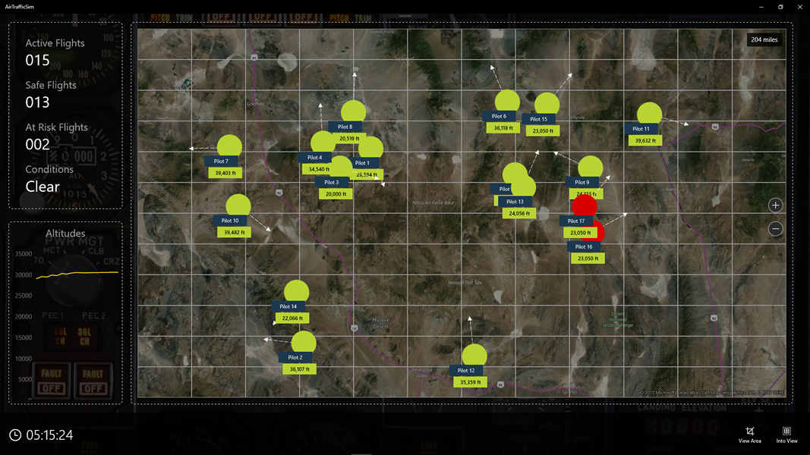
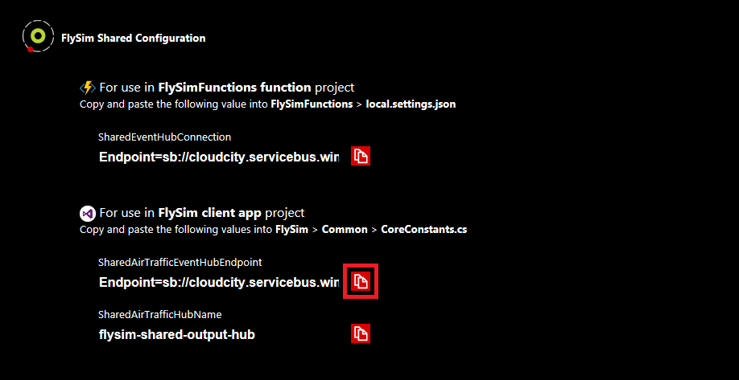
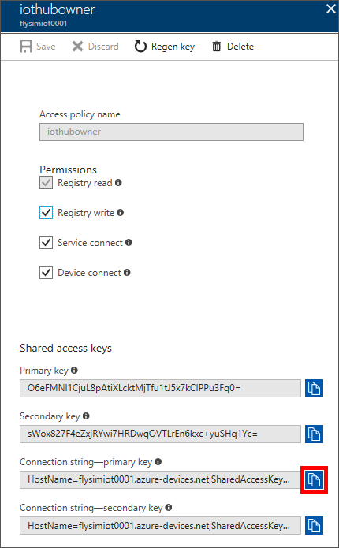
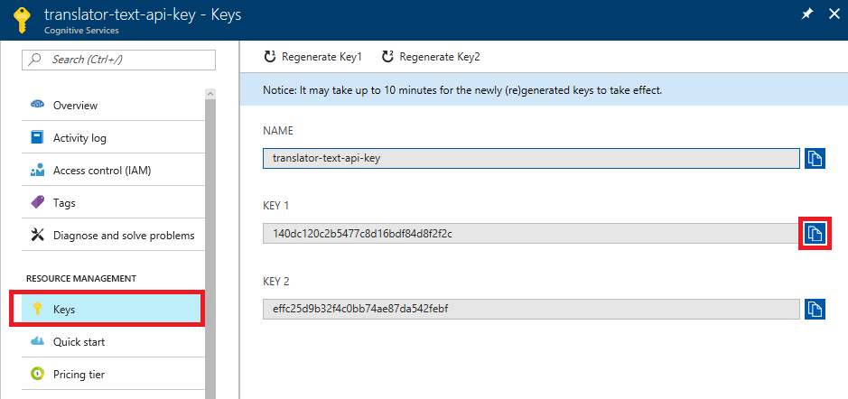
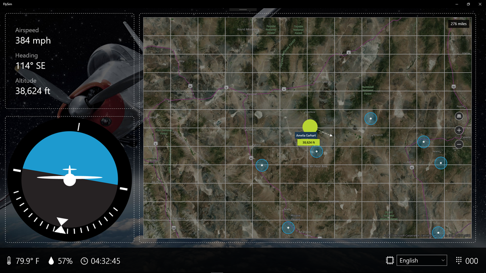
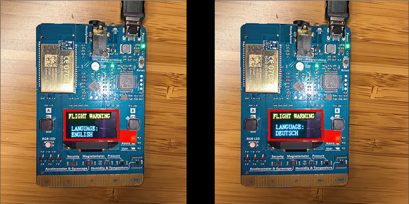
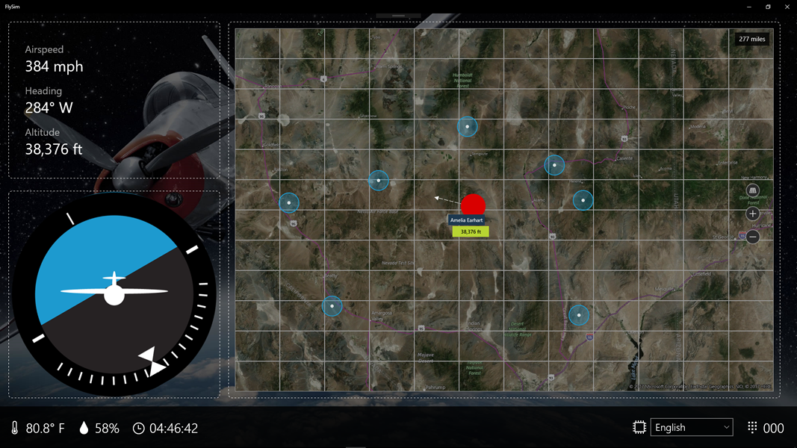

<a name="HOLTitle"></a>
# Putting It All Together #

---

<a name="Overview"></a>
## Overview ##

In the previous session, your flight instructor created an [Azure Stream Analytics](https://azure.microsoft.com/services/stream-analytics/) job that analyzes incoming data for aircraft that are too close together. He or she also created a pair of Event Hubs: one to provide input to the Stream Analytics job, and another to receive output.

In this lab, you will close the loop by marrying what you built in Labs 1 and 2 with what the instructor built in Lab 3 to assemble a complete end-to-end solution. First, you will modify the Azure Function you wrote in Lab 2 to transmit flight data to the shared input hub — the one that provides input to Stream Analytics — so Stream Analytics *and* the ATC app presented at the end of the previous session can see all of the aircraft in the room.



Second, you will connect the client app that you built in Lab 2 to the shared output hub — the one that receives output from Stream Analytics — so that when your aircraft comes too close to another and turns red in the ATC app, it turns red in the client app, too.

Third, you will modify the client app so that when it is notified that your aircraft is too close to another, it transmits a warning message back to the MXChip through the IoT Hub that the device is connected to. The MXChip will respond by displaying the warning on its screen. To top it off, you will use [Microsoft Cognitive Services](https://azure.microsoft.com/services/cognitive-services/) to translate the warning message into the language of the user's choice.

Finally, you will join with others in the room to fly through a crowded air-traffic control sector, and see all the different pieces of the solution work together to analyze large volumes of data in real time and help ensure that all planes arrive safely at their destinations.

<a name="Prerequisites"></a>
### Prerequisites ###

The following are required to complete this lab:

- An [MXChip IoT DevKit](https://microsoft.github.io/azure-iot-developer-kit/)
- A computer running [Windows 10 Anniversary Edition](https://www.microsoft.com/en-us/software-download/windows10) or higher
- [Visual Studio 2017](https://www.visualstudio.com/downloads/) Community edition version 15.3 or higher with the UWP and Azure workloads installed
- An active Microsoft Azure subscription. If you don't have one, [sign up for a free trial](http://aka.ms/WATK-FreeTrial)
- An available WiFi connection or mobile hotspot

---

<a name="Exercises"></a>
## Exercises ##

This lab includes the following exercises:

- [Exercise 1: Connect the Azure Function to the shared input hub](#Exercise1)
- [Exercise 2: Connect the client app to the shared output hub](#Exercise2)
- [Exercise 3: Update the client app to talk back to the device](#Exercise3)
- [Exercise 4: Test the finished solution](#Exercise4)
 
Estimated time to complete this lab: **60** minutes.

<a name="Exercise1"></a>
## Exercise 1: Connect the Azure Function to the shared input hub ##

In Lab 2, you deployed an Azure Function that reads input from an IoT hub, transforms accelerometer data coming from your MXChip into flight data, and transmits the output to an Azure Event Hub that provides input to the FlySim app. In this exercise, you will add an output to the Azure Function so that it transmits the same flight data to the shared input hub created by the instructor in Lab 3. Because everyone else in the room is making the same modification, and because the shared input hub provides data to the ATC app and to Stream Analytics, the ATC app will be able to show all the aircraft that are in the air, and the Stream Analytics job will be able to detect when aircraft come too close together.   

1. Start Visual Studio and open the FlySimFunctions solution that you created in Lab 2.

1. Add the following parameter to the ```Run``` method:

	```C#
	[EventHub("sharedouteventhub", Connection = "SharedEventHubConnection")] IAsyncCollector<string> sharedOutputMessage,
	```

	The modified method signature should look like this:

	

    _The modified Run method_

	The ```sharedOutputMessage``` parameter that you added represents output messages to the shared Event Hub.

1. Scroll down to the end of the ```Run``` method and add the following statement, just after the statement that calls ```outputMessage.AddAsync()``` and before the call to ```log.Info()```:

	```C#
	await sharedOutputMessage.AddAsync(outputPayload);
	```

	The last four lines of the method should now look like this:

	

    _The modified Run method_

	The statement that you added transmits the same flight data to the shared Event Hub that is already being transmitted to the "private" Event Hub you created in Lab 2.

1. Open **local.settings.json** and insert the following statement directly below   "EventHubConnection:"

	```Json
	 "SharedEventHubConnection": "SHARED_EVENT_HUB_ENDPOINT",
	```

1. Navigate to http://bit.ly/FlySimConfig in your browser and click the **Copy** button next to "SharedEventHubConnection" to copy the connection string for the shared input hub — the one that provides input to Stream Analytics — to the clipboard.

	> Where did the connection string come from? When your instructor ran the AirTrafficSim app at the end of the previous lab, the app uploaded the connection string to the Web site.
	
	

    _Copying the connection string to the clipboard_

1. Return to Visual Studio and replace "SHARED_EVENT_HUB_ENDPOINT" in **local.settings.json** with the value on the clipboard. 

1. Save your changes and rebuild the solution to ensure that it builds successfully. Then right-click the project in Solution Explorer and use the **Publish...** command to publish the updated Azure Function.

1. The next step is to add the shared input hub's connection string to the Function App's application settings. Go to the Azure Portal and open the Function App that you published in Lab 2. Then click **Application settings**.

	

	_Opening application settings_

1. Click **+ Add new setting** in the "Application settings" section. Add a setting named "SharedEventHubConnection" and set its value equal to the connection string that's on the clipboard. (If the connection string is no longer on the clipboard, you can return to http://bit.ly/FlySimConfig and copy it from there.) When you're finished, click **Save** at the top of the blade.

	

    _Adding an application setting_

1. Connect your MXChip to your laptop if it isn't already connected. Confirm that it's sending data by watching for "IN FLIGHT" to appear on the screen of the device. Then turn to the ATC app on the screen at the front of the room and watch for your airplane to appear. If necessary, ask the instructor to zoom out so that all aircraft are visible. Seeing your airplane on the big screen is confirmation that you did everything correctly in this exercise.

	> If your airplane doesn't show up on the big screen, go to the Azure Function in the portal and check the output log to make sure it's sending and receiving data. If it is, double-check the connection string you added in Step 9 and make sure its value is the one you retrieved from the FlySim configuration portal in Step 5.

The Azure Function has now been updated to send flight information to the shared input hub, enabling air-traffic control to be aware of your plane's location. Now it's time to connect the Event Hub that receives output from Stream Analytics to the client app so the client app can be notified when your airplane is too close to another and can respond accordingly.

<a name="Exercise2"></a>
## Exercise 2: Connect the client app to the shared output hub ##

In Lab 3, the instructor created an Event Hub and configured Stream Analytics to send output to it. He or she also connected the ATC app to the Event Hub so the app could highlight planes that are too close together on the air-traffic control map. In this exercise, you will connect the FlySim client app to the same Event Hub so it can notify individual pilots when the distance between their aircraft and any other is less than two miles.

1. Open the FlySim solution from Lab 2 in Visual Studio.

1. Open **CoreConstants.cs** in the "Common" folder, and add the following statements after the statements that declare static strings named ```FlightActivityEventHubEndpoint``` and ```FlightActivityEventHubName```:

	```C#
	public static string SharedAirTrafficEventHubEndpoint = "SHARED_EVENT_HUB_ENDPOINT";
    public static string SharedAirTrafficHubName = "flysim-shared-output-hub";
	```

1. Navigate to http://bit.ly/FlySimConfig in your browser and click the **Copy** button next to "SharedAirTrafficEventHubEndpoint" to copy the connection string for the shared output hub — the one that receives output from Stream Analytics — to the clipboard.

	

    _Copying the connection string to the clipboard_

1. Return to Visual Studio and replace "SHARED_EVENT_HUB_ENDPOINT" in **CoreConstants.cs** with the value on the clipboard. 

1. Right-click the "Listeners" folder in Solution Explorer and use the **Add** > **New Item...** command to add a class file named **AirTrafficListener.cs**. Then replace the contents of the file with the following code:

	```C#
	using Newtonsoft.Json;
	using ppatierno.AzureSBLite.Messaging;
	using System;
	using System.Collections.Generic;
	using System.Collections.ObjectModel;
	using System.Linq;
	using System.Numerics;
	using System.Text;
	using System.Threading.Tasks;
	using Windows.UI.Core;
	
	namespace FlySim.Listeners
	{
	    public class AirTrafficListener
	    {
	        private EventHubClient client { get; set; }
	        private EventHubConsumerGroup consumerGroup { get; set; }
	        private EventHubReceiver receiver { get; set; }
	        private FlightInformation flightInformation { get; set; }
	        private ObservableCollection<ActivePlaneInformation> activePlanes { get; set; }
	
	        public async void StartListeningAsync(FlightInformation flightInformation, ObservableCollection<ActivePlaneInformation> activePlanes)
	        {
	            this.activePlanes = activePlanes;
	            this.flightInformation = flightInformation;
	            this.client = EventHubClient.CreateFromConnectionString(Common.CoreConstants.SharedAirTrafficEventHubEndpoint, Common.CoreConstants.SharedAirTrafficHubName);
	
	            this.consumerGroup = this.client.GetDefaultConsumerGroup();
	            this.receiver = this.consumerGroup.CreateReceiver("0", DateTime.Now.ToUniversalTime());
	
	            await System.Threading.Tasks.Task.Run(() => StartListeningForTrafficCommands());
	        }
	
	        private async void StartListeningForTrafficCommands()
	        {
	            List<PlaneStatusInformation> statusInfo = new List<PlaneStatusInformation>();
	
	            while (true)
	            {
	                await Task.Delay(1);
	
	                try
	                {
	                    var eventData = this.receiver.Receive();
	
	                    if (eventData != null)
	                    {
	                        byte[] bytes = eventData.GetBytes();
	                        var payload = Encoding.UTF8.GetString(bytes);
	                        statusInfo.Clear();
	
	                        try
	                        {
	                            foreach (var info in payload.Split("\r\n".ToCharArray(), StringSplitOptions.RemoveEmptyEntries))
	                            {
	                                var status = JsonConvert.DeserializeObject<PlaneStatusInfo>(info);
	
	                                statusInfo.Add(new PlaneStatusInformation()
	                                {
	                                    DisplayName = status.deviceId,
	                                    Distance = Convert.ToDouble(status.distance),
	                                    Timestamp = DateTime.ParseExact(status.endtime, @"yyyy-MM-dd\THH:mm:ss.fffffff\Z", System.Globalization.CultureInfo.InvariantCulture),
	                                    EventTime = DateTime.ParseExact(status.eventtime, @"yyyy-MM-dd\THH:mm:ss.fffffff\Z", System.Globalization.CultureInfo.InvariantCulture),
	
	                                });
	                            }
	                        }
	                        catch(Exception)  {}
	                    }
	
	                    var atRiskPlanes = (from info in statusInfo
	                                        where info.Distance < Common.CoreConstants.AtRiskThreshold
	                                        select info.DisplayName);
	
	                    App.ViewModel.AtRiskPlanes = atRiskPlanes.Distinct().ToList();
	                }
	                catch(Exception) { }
	            }
	        }
	    }
	}
	```

	The purpose of this code is to listen for events coming from the shared output hub and to update the view-model if your plane is among those "at risk." If it is, it turns red in the view. The heavy lifting is performed by the ```EventHubClient``` and ```EventHubReciver``` classes, which are part of the NuGet package [AzureSBLite](https://github.com/ppatierno/azuresblite). 

1. Open **MainViewModel.cs** in the project's "ViewModels" folder and insert the following line of code below the ```FlightActivityListener``` property on line 40 to create an instance of ```AirTrafficListener```:

	```C#
	public AirTrafficListener AirTrafficListener = new AirTrafficListener();
	```

1. Still in **MainViewModel.cs**, locate the ```InitializeSystem``` method and add the following line of code to it: 

	```C#
	this.AirTrafficListener.StartListeningAsync(this.CurrentFlightInformation, this.ActivePlanes);
	```

1. Rebuild the solution and confirm that your changes compile successfully.
 
FlySim now has the smarts to turn your airplane red if it receives information from the shared output hub indicating that it's within two miles of another plane. But don't run it just yet. Let's further enhance the app to display a warning on the screen of the MXChip when your plane is too close to another.

<a name="Exercise3"></a>
## Exercise 3: Update the client app to talk back to the device ##

One of the benefits of using Azure IoT Hubs is that they support bidirectional communication. Devices can send messages to IoT Hubs, and IoT Hubs can send messages back to the devices connected to them. In this exercise, you will modify the FlySim client app to send a message to your MXChip through the IoT Hub it's connected to when your airplane is too close to another airplane. That message will command the MXChip to display a warning message on its screen. For an added touch, you will use Microsoft Cognitive Services to translate the warning message into the language of the user's choice before displaying it on the device. 

1. In Visual Studio, open **CoreConstants.cs** in the project's "Common" folder and insert the following statement after the statement declaring ```SharedAirTrafficHubName``` that you added in the previous exercise:

	```C#
	public static string DeviceMessagingConnectionString = "IOT_DEVICE_ENDPOINT";
	```

1. Return to the Azure Portal and open the IoT Hub that you created in Lab 1. Click **Shared access policies**, and then click **iothubowner**.

	

	_Viewing shared-access policies for the IoT Hub_

1. Click the **Copy** button to the right of "Connection string—primary key" to copy the connection string to the clipboard.

	

    _Copying the connection string to the clipboard_

1. Return to Visual Studio and replace "IOT_DEVICE_ENDPOINT" in **CoreConstants.cs** with the connection string on the clipboard.

1. Right-click the "Helpers" folder in Solution Explorer and use the **Add** > **New Item...** command to add a class file named **MessageHelper.cs**. Then replace the contents of the file with the following code:

	```C#
	using Microsoft.Azure.Devices;
	using System;
	using System.Collections.Generic;
	using System.Linq;
	using System.Text;
	using System.Threading.Tasks;
	
	namespace FlySim.Helpers
	{
	    public static class MessageHelper
	    {
	        public async static Task<bool> SendMessageToDeviceAsync(string message)
	        {
	            bool successful = false;
	
	            try
	            {
	                var serviceClient = ServiceClient.CreateFromConnectionString(Common.CoreConstants.DeviceMessagingConnectionString);
	                var commandMessage = new Message(Encoding.ASCII.GetBytes(message.ToUpper()));
	                await serviceClient.SendAsync("AZ3166", commandMessage);
	                successful = true;
	            }
	            catch(Exception) { }
	
	            return successful;
	        }
	    }
	}
	```

	The ```MessageHelper``` class contains a method named ```SendMessageToDeviceAsync``` that transmits an ASCII message to the device connected to the IoT hub. The message is transmitted by calling ```SendAsync``` on an instance of the ```Microsoft.Azure.Devices.ServiceClient``` class, which is included in the NuGet package named Microsoft.Azure.Devices. A listener in the embedded code you uploaded to the device in Lab 1 handles the message and executes the appropriate commands to display the text contained in the message on the screen of the device for 5 seconds before reverting back to the normal "IN FLIGHT" display.

1. In the lower-right corner of the FlySim app, there is a ComboBox control containing a list of languages. (The default is English.) The purpose of the ComboBox is to allow you to select the language used for warning messages displayed on the screen of the MXChip.

	The app retrieves a list of supported languages from the [Translator Text API](https://www.microsoft.com/translator/translatorapi.aspx), which is one of more than two dozen services available in [Microsoft Cognitive Services](https://azure.microsoft.com/services/cognitive-services/). The Translator Text API can translate text from English into more than 50 different languages, including two dialects of Klingon. (Yes, Klingon!) It can also provide a list of languages it can translate to, which forms the basis for the list you see in the ComboBox control.

	In order to call the Translator Text API, you must go to the Azure Portal and obtain an API key. Calls to the Translator Text API work right now because **CoreConstants.cs** contains a key that was provided for you. Before going further, you need to obtain a key of your own and replace the one in **CoreConstants.cs**.

	To that end, return to the [Azure Portal](https"//portal.azure.com) and click **+ New**, followed by **AI + Cognitive Services** and **See all**.

	

	_Adding a Cognitive Service_

1. Click **More** in the "Cognitive Service" section to see a list of all Cognitive Services.

	

	_Viewing all Cognitive Services_

1. Scroll down and click **Translator Text API**. Then click the **Create** button at the bottom of the ensuing "Translator Text API" blade.

	

	_Selecting the Translator Text API_

1. Fill in the information shown below. Then click the **Create** button.

	

	_Creating an API key_

1. Return to the "FlySimResources" resource group and click **translator-text-api-key**.

	

	_Opening the API key_

1. Click **Keys** in the menu on the left. Then click the **Copy** button to the right of "KEY 1" to copy the API key to the clipboard.

	

	_Copying the API key to the clipboard_

1. Return to Visual Studio. In **CoreConstants.cs**, replace the value of the field named ```TranslatorTextSubscriptionKey``` with the API key on the clipboard.

1. The project already contains a class named ```TranslationHelper``` located in the "Helpers" folder. Open the file named **TranslationHelper.cs** in that folder and take a moment to examine the code. The class contains three methods. The one that translates text from one language to another is named ```GetTextTranslationAsync```. It uses the Universal Windows Platform's ```HttpClient``` class to place a REST call to the Translator Text API's HTTP endpoint with the API key embedded in an ```Ocp-Apim-Subscription-Key``` header. It is that simple to translate text when you utilize the Translator Text API.

1. Return to **MainViewModel.cs** in Visual Studio and replace the ```SendWarningMessage``` method with this one:

	```C#
	private async void SendWarningMessage()
    {
        string message = "Warning";

        if (!this.SelectedLanguage.DisplayName.Equals("English"))
        {
            message = await Helpers.TranslationHelper.GetTextTranslationAsync(message, this.SelectedLanguage.Abbreviation);
        }

        await Helpers.MessageHelper.SendMessageToDeviceAsync(message);
    }
	```

	This method calls ```TranslationHelper.GetTextTranslationAsync``` to convert the warning message to the language selected in the ComboBox (unless English is selected, in which case no translation is necessary), and then calls ```MessageHelper.SendMessageToDeviceAsync``` to send the message to the device.

1. Finish up by building the solution and verifying that it builds without errors.

The stage is set. The FlySim app is connected to the output from Stream Analytics so it can warn you when your airplane is too close to another. All that remains is to test it out. It's time to get back into the air. And this time, you won't be alone. 

<a name="Exercise3"></a>
## Exercise 4: Test the finished solution ##
	
Now comes all the fun, and this will be a great introduction into this exercise.

In this exercise, you will continue to navigation and practice flying. This is what you've been waiting for—flying around the Nevada Desert where a large number of pilots will be competing for air space. I know Jeff will update this so I won't go into much more detail.

1. Unplug the **Micro USB cable** from your IoT device and then plug it back in again to ensure fresh data is being sent from your device to the IoT Hub.

1. Start FlySim in debugging mode by clicking the run on **Local Machine** in the Visual Studio IDE or pressing **F5** on your keyboard. 

1. Just as in Lab #2, FlySim will load and display your plane in an "uninitialized" state somewhere in the Nevada desert.

1. Continue navigating your plane by tilting the MXChip IoT DevKit device left and right to "turn" and observe the changes to the **artificial horizon control**, as well as changes to your **heading** in the **active flight information panel**, as well as ascend and descend by tilting the device forward or backward and observe the changes to the **artificial horizon control**, as well as changes to your **altitude** in the **active flight information panel**.

	
    _Navigating around the Nevada Desert in FlySim_ 

	Continue navigating around the map until you gain more confidence if your ability to control your plane, paying close attention to your altitude. If your plane leaves the map area you can simply tap the plane visual in the "artificial horizon control" to locate your plane on the map.

1. Ensure your device can receive messages from the IoT Hub, by selecting a different language from the language drop-down in the lower-right panel, then observe the change in display on your device to reflect a flight warning that your messaging language has changed, for example from "English" to "Deutsch" (German). 	

	
    _The MXChip IoT DevKit device reflecting a language change_

	As more participants complete this exercise, you may notice the status of your plane change from green to red, indicating communication has been received from air traffic control indicating you are flying too close to another plane, and need to make an immediate adjustment, as. For example descending or turning the left or right. 
	
	
    _FlySim indicating your plane is current "at risk"_ 

	When your plane status initially changes to "at risk" status, a message will also be sent your device indicating a flight warning, at which time the device LED will turn red, alerting you to the need to make an immediate adjustment to your flight pattern.
	
	
    _The MXChip IoT DevKit device reflecting a flight warning_

At this point in the lab, the instructor should have the air traffic control system (AirTrafficSim) running in the front of the room for all participants to view. It may help you navigate by referencing your location, in relation to other planes, based on activity on the screen.	


_Active flights in the air traffic control app_

Good luck and happy trails! Jeff, it's all yours!

<a name="Summary"></a>
## Summary ##

That's it for Part 4 of Cloud City. As usual, Jeff will add what he thinks sounds best here! Thanks, Jeff, you rock!