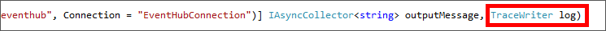
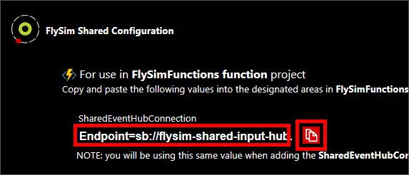
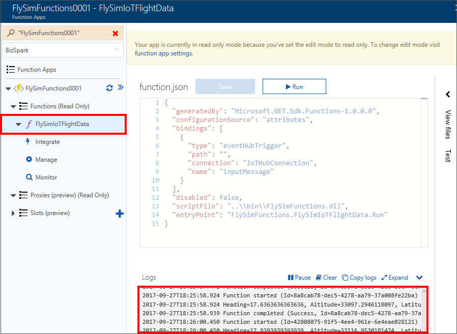
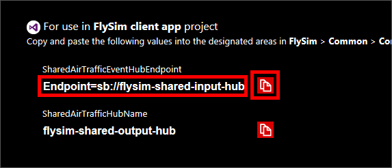
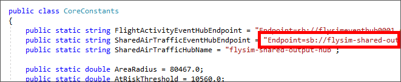

<a name="HOLTitle"></a>
# Putting It All Together #

---

<a name="Overview"></a>
## Overview ##

In the previous session, your flight instructor created an [Azure Stream Analytics](https://azure.microsoft.com/services/stream-analytics/) job that analyzes incoming data for aircraft that are too close together. He or she also created a pair of Event Hubs: one to provide input to the Stream Analytics job, and another to receive output.

In this lab, you will close the loop by marrying what you built in Labs 1 and 2 with what the instructor built in Lab 3 to assemble a complete end-to-end solution. First, you will modify the Azure function you wrote in Lab 2 to transmit flight data to the shared input hub — the one that provides input to Stream Analytics — so Stream Analytics *and* the ATC app presented at the end of the previous session can see all of the aircrafts in the room.


Second, you will connect the client app that you built in Lab 2 to the shared output hub — the one that receives output from Stream Analytics — so that when your aircraft comes too close to another and turns red in the ATC app, it turns red in the client app, too.

Third, you will modify the client app so that when it is notified that your aircraft is too close to another, it transmits a warning message back to the MXChip through the IoT Hub that the device is connected to. The MXChip will respond by displaying the warning on its screen. To top it off, you will use [Microsoft Cognitive Services](https://azure.microsoft.com/services/cognitive-services/) to translate the warning message into the language of the user's choice.

Finally, you will join with others in the room to fly through a crowded air-traffic control sector, and see all the different pieces of the solution work together to analyze large volumes of data in real time and help ensure that everyone arrives safely at their destination.

<a name="Prerequisites"></a>
### Prerequisites ###

The following are required to complete this lab:

- An [MXChip IoT DevKit](https://microsoft.github.io/azure-iot-developer-kit/)
- A computer running [Windows 10 Anniversary Edition](https://www.microsoft.com/en-us/software-download/windows10) or higher
- [Visual Studio 2017](https://www.visualstudio.com/downloads/) Community edition version 15.3 or higher with the UWP and Azure workloads installed
- An active Microsoft Azure subscription. If you don't have one, [sign up for a free trial](http://aka.ms/WATK-FreeTrial)
- An available WiFi connection or mobile hotspot

---

<a name="Exercises"></a>
## Exercises ##

This lab includes the following exercises:

- [Exercise 1: Update the Azure Function to connect to a “shared” Event Hub](#Exercise1)
- [Exercise 2: Update the flight simulator app to connect to a “shared” Stream Analytics job](#Exercise2)
- [Exercise 3: Update the flight simulator app to send messages to an IoT device](#Exercise3)
- [Exercise 4: Practice flying in shared air space](#Exercise4)
 
Estimated time to complete this lab: **60** minutes.

<a name="Exercise1"></a>
## Exercise 1: Update the Azure Function to connect to a “shared” Event Hub ##

In order to send local flight information to air traffic control you will need to make a few changes to code created previously. In this exercise, you will be updating the Azure Function you creating in Lab 2 to connect to a "shared" Event Hub.

1. In Visual Studio 2017, open the **FlySimFunctions** project created and deployed in Lab 2, Exercise 3.

1. Open **FlySimIotFlightData.cs** and scroll to view the function **Run** method on **line 23**, and locate the ```TraceWriter log``` parameter at the end of the parameter list.

	
    _Locating TraceWriter log in the Run method parameters_


1. Add a new parameter to the ```Run``` method by insert the following code directly before the ```TraceWriter log``` parameter, making certain to **include the trailing comma**.

	```C#
	[EventHub("sharedouteventhub", Connection = "SharedEventHubConnection")] IAsyncCollector<string> sharedOutputMessage,
	```

1. To additional send data to the shared Event Hub, insert the following line of code directly below ```await outputMessage.AddAsync(outputPayload);``` the on **line 84**:

	```C#
	await sharedOutputMessage.AddAsync(outputPayload);
	```

1. Open **local.settings.json** and insert the following new value directly below the  "EventHubConnection" value, again making certain to **include the trailing comma**:

	```Json
	 "SharedEventHubConnection": "SHARED_EVENT_HUB_ENDPOINT",
	```
	The Azure Function app will require the value of the "SharedEventHubConnection" connection string to be updated before deploying your function:
 
1. Open a browser and navigate to [http://bit.ly/FlySimConfig](http://bit.ly/FlySimConfig "http://bit.ly/FlySimConfig") to view the shared configuration settings for your current training session.

1. Click the **copy icon** to the left if the "SharedEventHubConnection" value to copy the endpoint connection string to the clipboard.
	
	
    _Copying the SharedEventHubConnection value to the clipboard_

1. Back in Visual Studio 2017, paste to replace the value "SHARED_EVENT_HUB_ENDPOINT" in **local.settings.json** with the value from the clipboard. 

1. In Solution Explorer, right-click the **FlySimFunctions** project  use the **Build** > **Rebuild Solution** command to ensure your function compiles successfully.

1. Still in Solution Explorer, right-click the **FlySimFunctions** project once more and select **Publish...**, then click **Publish** to publish your updated function to the Azure portal.

1. After a short delay, a status of "Publish Succeeded" will appear at the bottom of the Visual Studio Output window, which means your Azure Function has now been deployed successfully as an Azure App Service.
  
	With your function updated with a new configration value, your need to make sure the local settings used in your Visual Studio environment get updated in the Azure portal.

1. Unplug the **Micro USB cable** from your MXChip IoT DevKit device.

1. In the Azure portal, navigate to **FlySimResources** and select the new Function App (such as "FlySimFunctions0001") you published in the previous steps.

1. On the Function Apps "Overview" tab, click **Application Settings**.
 
1. Scroll to the "Application settings" section at the bottom of the screen, and add the following keys and values to match your development environment.
	
	- Add key: **SharedEventHubConnection**
	- Add value: Copy and paste in the endpoint connection string value of the **SharedEventHubConnection** key from **local.settings.json**

1. Scroll to the top of the "Application Settings" tab and click **Save** to allow your function to begin using these new values.

1. Plug the **Micro USB cable** back into your MXChip IoT DevKit device, and wait for the device to initialize and begin displaying "IN FLIGHT" values.

1. Back in the Azure portal, select the **FlySimIoTFlightData** function from the left-navigation, expand the **Logs** panel at the bottom, and confirm the function is receiving and sending data.

	
    _The FlySimIoTFlightData function running in the portal_
 
	>If you believe you have configured your function correctly, but do not see any entries in the log output, try disconnecting and re-connecting the Micro USB cable on your device one more time. This will effectively reset the device and re-initiate communication with the IoT Hub.

Your Azure Function has now been updated to send flight information to the "shared" Event Hub, ensuring air traffic control will be aware of your plane's current location at all times. With these updates in place it's time to add the ability to listen to air traffic control commands in the FlySim client app.

<a name="Exercise2"></a>
## Exercise 2: Update the flight simulator app to connect to a “shared” Stream Analytics job ##

In order to listen for commands from air traffic control, you will need to make a few changes to the FlySim client app created in Lab 2. 

In this exercise, you will be updating FlySim to connect to a “shared” Stream Analytics job used by air traffic control.

1. In Visual Studio 2017, close the **FlySimFunctions** solution, then use the **File** > **Open** > **Project/Solution** command to open the **FlySim** project created in Lab 2, Exercise 4.

1. In Solution Explorer, open **CoreConstants.cs** in the **Common** folder, and locate the **FlightActivityEventHubEndpoint** constant.

1. Insert the following code directly below the "FlightActivityEventHubEndpoint" constant.

	```C#
	public static string SharedAirTrafficEventHubEndpoint = "SHARED_EVENT_HUB_ENDPOINT";
    public static string SharedAirTrafficHubName = "flysim-shared-output-hub";
	```
1. Open a browser and navigate to [http://bit.ly/FlySimConfig](http://bit.ly/FlySimConfig "http://bit.ly/FlySimConfig") to view the shared configuration settings for your current training session.

1. Click the **copy icon** to the left if the "SharedAirTrafficHubEndpoint" value to copy the endpoint connection string to the clipboard.
	
	
    _Copying the SharedEventHubConnection value to the clipboard_

1. Replace the value "SHARED_EVENT_HUB_ENDPOINT" with the **EventHubConnection endpoint connection string** you used in the previous exercise (when adding keys and values to the function Application Settings.) If you are uncertain of this value you can refer to Exercise 3, Step 11 for instructions.

1. Back in Visual Studio 2017, paste to replace the value "SHARED_EVENT_HUB_ENDPOINT" with the value from the clipboard. 

	
    _An updated SharedAirTrafficHubEndpoint in CoreConstants.cs_
 
	With FlySim connected to the shared Azure Event Hub you're ready to start testing by making sure the client app is "listening" for communication from air traffic control.

1. In Solution Explorer, right-click the **Listeners** folder, use the **Add** > **Existing Item...** command to add the **AirTrafficListener.cs** file from the **Resources** folder included in this lab.

1. Still in Solution Explorer, open **ViewModels** > **MainViewModel.cs** and insert the following line of code directly below the "FlightActivityListener" property on line 39:

	```C#
	public AirTrafficListener AirTrafficListener = new AirTrafficListener();
	```
1. Still in **MainViewModel.cs**, locate the **InitializeSystem** method and insert the following line of code into the method: 

	```C#
	this.AirTrafficListener.StartListeningAsync(this.CurrentFlightInformation, this.ActivePlanes);
	```
1. Right-click the **FlySim** solution and use the **Build** > **Rebuild Solution** command to ensure your changes compile successfully.
 
Your flight simulator app is now ready to listen for communication from air traffic control. This will be important in the next exercises as you practice flying while sharing air space with other pilots.

<a name="Exercise3"></a>
## Exercise 3: Update the flight simulator app to send messages to an IoT device ##

When warning commands are received from air traffic control, your flight simulator app will need to communicate these messages to your MXChip IoT DevKit device. 

In this exercise, you will be updating FlySim to connect to send messages to you MXChip IoT DevKit device, optionally translated into a display language of your choice.

1. Still in Visual Studio 2017, open **CoreConstants.cs** in the **Common** folder, and locate the **SharedAirTrafficHubName** constant added in the previous exercise.

1. Insert the following code directly below the "SharedAirTrafficHubName" constant.

	```C#
	public static string DeviceMessagingConnectionString = "IOT_DEVICE_ENDPOINT";
	```
1. In a browser, open the Azure portal and navigate to the **IoT Hub** created in the Lab 2 (such as "flysimiot0001"), select **Shared access policies** from the "SETTINGS" group, then select **iothubownerpolicy** under "POLICY" to display the "iothubowner" policy dialog.

1. Copy the value of **Connection string—primary key** to the clipboard.

	
    _Copying the IoT Hub connection string to the clipboard_

1. Back in Visual Studio 2017, paste to replace "IOT_DEVICE_ENDPOINT" in CoreConstants.cs "DeviceMessagingConnectionString" constant with the IoT value copied to the clipboard.

1. In Solution Explorer, right-click the **Helpers** folder, use the **Add** > **Existing Item...** command to add the **MessageHelper.cs** file from the **Resources** folder included in this lab.

1. Still in Solution Explorer, open **ViewModels** > **MainViewModel.cs** and insert the following line of code **below** the "MainViewModel" class initializer:

	```C#
	public ICommand SendLanguageChangedCommand { get; private set; }
	```  
1. Still in MainViewModel.cs, locate the **InitializeLanguages** method, then add the following single line of code as the first line inside the method: 

	```C#
	 this.SendLanguageChangedCommand = new RelayCommand(async () => { await SendLanguageChangedMessageAsync(); });
	```

1. Add a new "SendLanguageChangedMessageAsync" method directly below the **InitializeLanguages** method by adding the following block of code:

	```C#
    public async Task<bool> SendLanguageChangedMessageAsync()
    {
        return await Helpers.MessageHelper.SendMessageToDeviceAsync($"Language:\r\n\t{this.SelectedLanguage.DisplayName}");
    }
	```
	
	This block of code will send a message to the device any time you make a langauge selection change in the client app.

1. Finally, Locate the **SendDescendMessage** method and replace the entire method with the following block of code:

	```C#
	private async void SendDescendMessage()
    {
        string message = "Warning";

        if (!this.SelectedLanguage.DisplayName.Equals("English"))
        {
            message = await Helpers.TranslationHelper.GetTextTranslationAsync(message, this.SelectedLanguage.Abbreviation);
        }

        await Helpers.MessageHelper.SendMessageToDeviceAsync(message);
    }
	```
	This block of code will send a message to the device any time a warning is received from air traffic control.

Now that your flight simulator app can listen for communciation from air traffic control, as well as communicate warning messages to your device, you're ready to start flying in "shared" air space, with other planes nearby, and potentially too close to your plane, placing your safety at risk.

<a name="Exercise3"></a>
## Exercise 4: Practice flying in shared air space ##
	
Now comes all the fun, and this will be a great introduction into this exercise.

In this exercise, you will continue to navigation and practice flying. This is what you've been waiting for—flying around the Nevada Desert where a large number of pilots will be competing for air space. I know Jeff will update this so I won't go into much more detail.

1. Unplug the **Micro USB cable** from your IoT device and then plug it back in again to ensure fresh data is being sent from your device to the IoT Hub.

1. Start FlySim in debugging mode by clicking the run on **Local Machine** in the Visual Studio IDE or pressing **F5** on your keyboard. 

1. Just as in Lab #2, FlySim will load and display your plane in an "uninitialized" state somewhere in the Nevada desert.

1. Continue navigating your plane by tilting the MXChip IoT DevKit device left and right to "turn" and observe the changes to the **artificial horizon control**, as well as changes to your **heading** in the **active flight information panel**, as well as ascend and descend by tilting the device forward or backward and observe the changes to the **artificial horizon control**, as well as changes to your **altitude** in the **active flight information panel**.

	
    _Navigating around the Nevada Desert in FlySim_ 

	Continue navigating around the map until you gain more confidence if your ability to control your plane, paying close attention to your altitude. If your plane leaves the map area you can simply tap the plane visual in the "artificial horizon control" to locate your plane on the map.

1. Ensure your device can receive messages from the IoT Hub, by selecting a different language from the language drop-down in the lower-right panel, then observe the change in display on your device to reflect a flight warning that your messaging language has changed, for example from "English" to "Deutsch" (German). 	

	
    _The MXChip IoT DevKit device reflecting a language change_

	As more participants complete this exercise, you may notice the status of your plane change from green to red, indicating communication has been received from air traffic control indicating you are flying too close to another plane, and need to make an immediate adjustment, as. For example descending or turning the left or right. 
	
	
    _FlySim indicating your plane is current "at risk"_ 

	When your plane status initially changes to "at risk" status, a message will also be sent your device indicating a flight warning, at which time the device LED will turn red, alerting you to the need to make an immediate adjustment to your flight pattern.
	
	
    _The MXChip IoT DevKit device reflecting a flight warning_

At this point in the lab, the instructor should have the air traffic control system (AirTrafficSim) running in the front of the room for all participants to view. It may help you navigate by referencing your location, in relation to other planes, based on activity on the screen.	


_Active flights in the air traffic control app_

Good luck and happy trails! Jeff, it's all yours!

<a name="Summary"></a>
## Summary ##

That's it for Part 4 of Cloud City. As usual, Jeff will add what he thinks sounds best here! Thanks, Jeff, you rock!